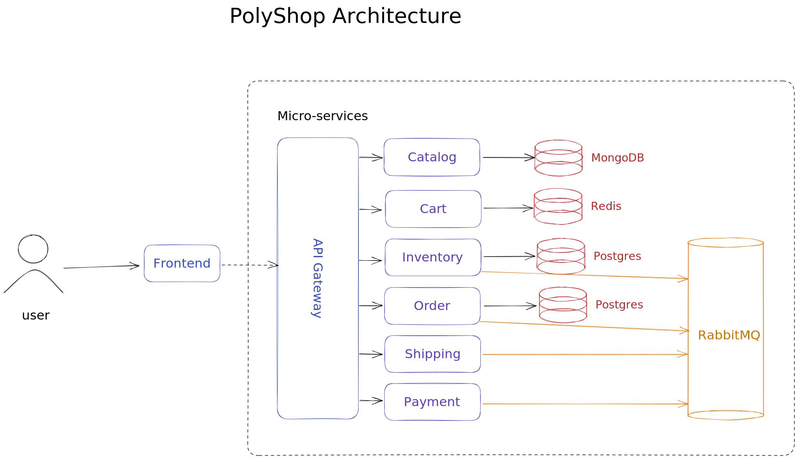
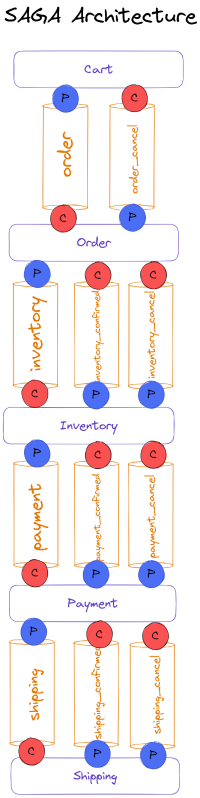
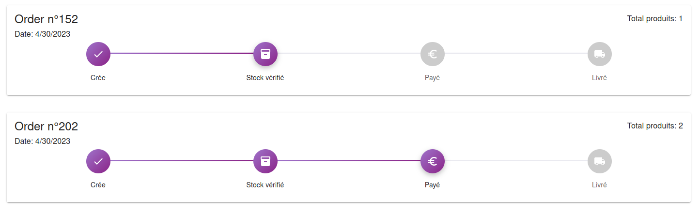
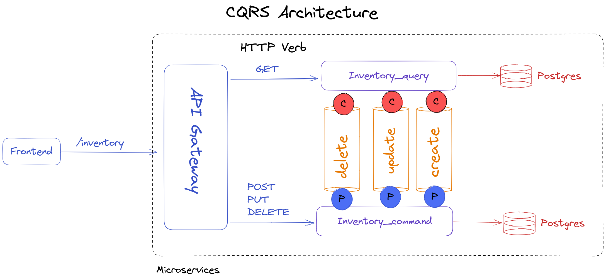
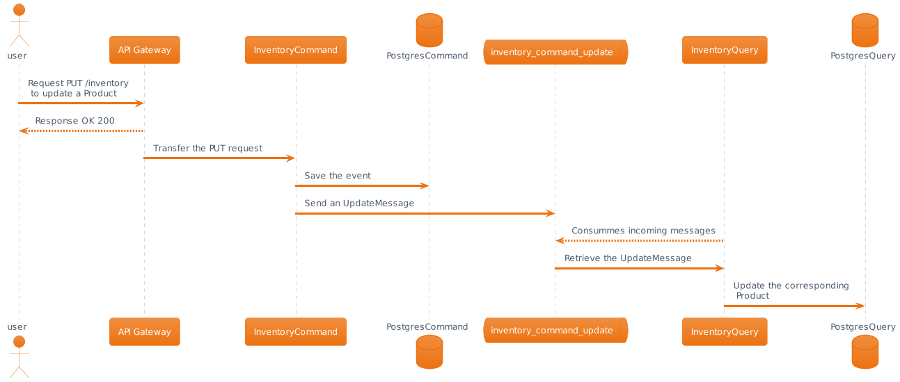

# PolyShop

This project is showcase a sample microservice architecture for a Shopping Application.

The project is deployed at the following URL : [polyshop.gridexx.fr](https://polyshop.gridexx.fr)

## Architecture

This project has the following services architecture. Each service own their own database and use a RabbitMQ service for events.




This projects implements two different pattern.

## SAGA

The SAGA pattern is a design pattern used in microservices architecture to manage transactions between different services. In a distributed system, a single transaction may involve multiple services that need to be coordinated in order to maintain consistency. The SAGA pattern defines a sequence of local transactions that are coordinated using a series of messages. Each service involved in the transaction executes its own local transaction, and then sends a message to the next service in the sequence to continue the transaction. This pattern is particularly useful in situations where long-running transactions are required, and is commonly implemented in Java microservices using frameworks like Spring.

Check the [tutorial](https://spring.io/blog/2018/05/21/using-spring-saga-to-coordinate-microservices).


### Implementation and design

RabbitMQ is used as a message broker and transmit message between services through queue.

Here is the leading Architecture:



**Legend**
<p><span style="color: blue">P(producer): </span> write messages into the queue.</p> 
<p><span style="color: red">C(consumer): </span> read messages from the queue.</p>

Each queue is used by two services. One consumer and one producer.

#### Queue

Services queues aims to deliver messages through services when a checkout is created.
Each service handle his own queue and transfer the message to the next service when operations on the checkout are okay.

#### Confirmed Queue

Confirmation queue are used by each service to say that operations succeed. Finally, those message are transmitted to the `order`. It is used to update the order status.

#### Cancel Queue

Those queue are used to send the information back that an error happened during the process.
Information about the operation are present in the message to make **compensation**

Here is the errors that could occurs:

- The inventory service has not the product in stock
- Payment service fails (1/3 chance)
- Shipping service fails (1/3 chance)

Finally, those message are transmitted to the `order`. It is used to update the order status.

Here is how looks the order status in the UI:



Thanks to compensation services are able of resetting pending operation:

- `Inventory` put back on stock the pending products 
- `Cart` reset the product in the shopping cart 
- `Order` update continually the status of the order

### Run it locally

```bash
docker-compose -f docker-compose_saga.yml up -d
```

## CQRS with event-sourcing

This project was also implemented using the [CQRS and event-sourcing pattern](https://www.baeldung.com/cqrs-event-sourcing-java) on the inventory service.

CQRS (Command Query Responsibility Segregation) and Event Sourcing are two related design patterns that are commonly used together in microservices architecture. CQRS separates the read and write operations of an application, allowing for more efficient scaling and optimization of each operation. Event sourcing stores all changes made to an application as a sequence of events, allowing for a complete history of changes to be reconstructed at any point in time. Together, these patterns can provide significant benefits in terms of scalability, resilience, and maintainability. Java microservices frameworks like Axon Framework provide built-in support for implementing CQRS and event sourcing in a distributed system.


Here is the diagram of the CQRS Architecture:



The Inventory_query service is reached on GET HTTP request, while the Inventory_command is used for PUT, POST and DELETE commands.

RabbitMQ Queues are use between the two services.
Each time a command is received by the `inventory_command` service:

- A message is send into the corresponding Queue to update the Row in the inventory_query's database
- An event is saved in the Postgres Database of the `inventory_command` service

Those events could be used to recreate from scratch the state of the final application. A timestamp was added to do so.

Here is the diagram sequence of a PUT Request made to update a product inventory as described like before:




### Run it locally

Those two services ares present in the following folder:

- `polyshop-inventory-command`
- `polyshop-inventory-query`

The gateway modified accordingly with a `cqrs` git tag.

To launch this pattern simply execute the following:

```bash
docker-compose -f docker-compose_cqrs.yml up -d
```

You can now try to made query on the inventory and inspect logs of both service with the following:
```bash
# Inspect the logs of the Query service
docker-compose logs inventory_query
# Inspect the logs of the Command service
docker-compose logs inventory_command
```


### Author

Written in April 2023 by [@GridexX](https://github.com/GridexX) with SpringBoot under the ☀️
